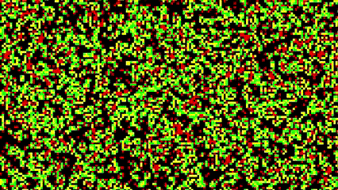
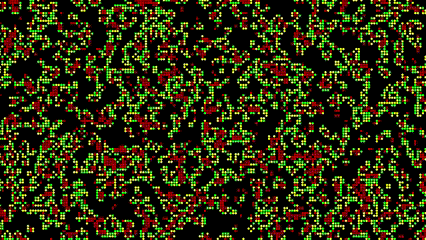
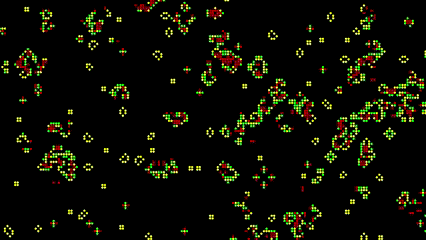

# Game-of-Life
PyGame version of the Game of Life simulation

 &nbsp; &nbsp; &nbsp; &nbsp; &nbsp; &nbsp; 

## overview
The Game of Life, also known simply as Life, is a cellular automaton devised by the mathematician John Conway. It is a zero-player game, meaning that its evolution is determined by its initial state, requiring no further input. One interacts with the Game of Life by creating an initial configuration and observing how it evolves.

The next sections explain how it works.
To get a version of it running on your machine scroll down.

# Rules 
The universe of the Game of Life is an infinite, two-dimensional orthogonal grid of square cells, each of which is in one of two possible states, live or dead. Every cell interacts with its eight neighbors, which are the cells that are horizontally, vertically, or diagonally adjacent. 
```
[0,N,N,N,0]
[0,N,C,N,0]
[0,N,N,N,0]
```
Where C represents a Cell, and N represent its neighbours.

## Next generation
1. Any live cell with two or three live neighbours lives on to the next generation.
2. Any dead cell with exactly three live neighbours becomes a live cell, as if by reproduction.
3. Any live cell with fewer than two live neighbours dies, as if by underpopulation.
4. Any live cell with more than three live neighbours dies, as if by overpopulation.

In this representation of the game of life, cells that survive to the next generation are visualized as yellow, cells that die are represented as red, and cells that are born are represented as green.

# Installation

### Prerequisites
- Python 3.x

1. Clone the repository
2. Navigate to the project directory

### Installing Required Libraries

This simulation uses Pygame for visualization and Numpy for vectorization. If you haven't installed Pygame or Numpy yet, you can install them using pip. Open your terminal and run the following command:

```sh
pip install pygame numpy
```

### Running the simulation

To run the simulation, run `main.py`
```sh
python main.py
```

# Configuration
In `config.py` there are options to customize everything
- CELL_SIZE is the dimension of each sand grain
- GRID_DIMS is the dimension of the simulation
- AS_CIRCLES boolean deciding if each cell is visualized as a circle or a square
- DIED, SURVIVED, and BORN colors for respective states of each cell
- CHECK_AXIS which color channel axis has 255 when the cell is alive
